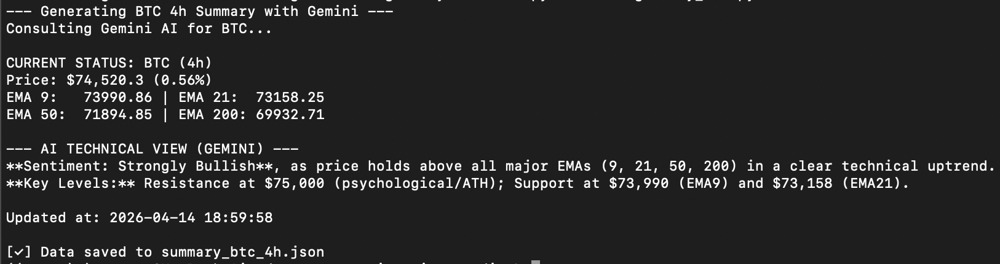
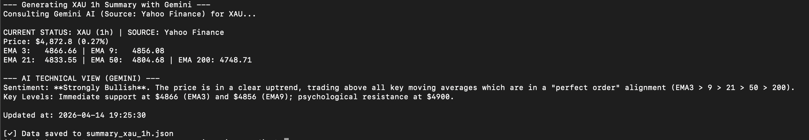
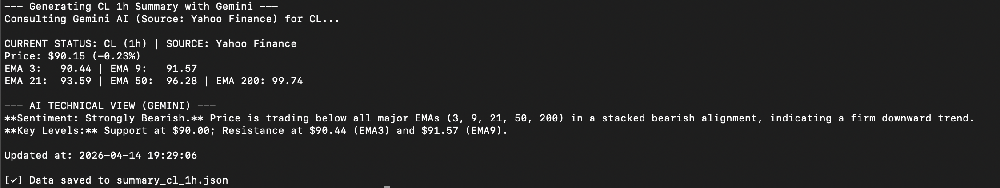
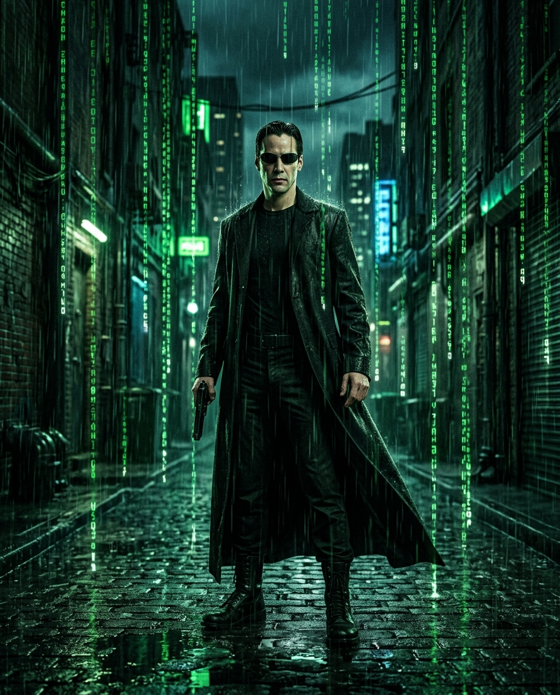
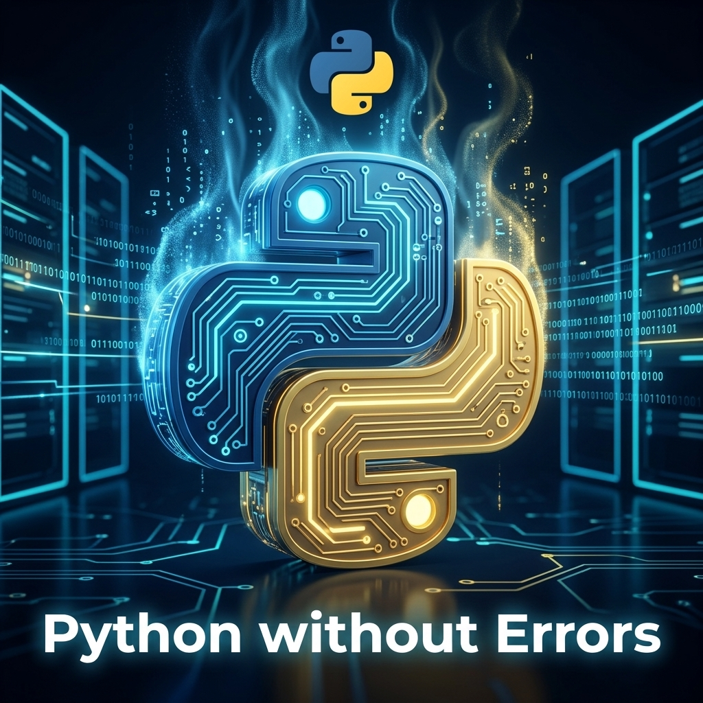

# antigravity-studio

Google Antigravity (Cloud Code Assist) client in pure Python — text chat + image generation + agentic tasks.

Enhanced with strategies from [Antigravity-Manager](https://github.com/lbjlaq/Antigravity-Manager) Rust project.

**Key features:** 3-tier endpoint fallback (Sandbox → Daily → Prod), free-tier project ID fallback,
safety settings OFF, auto-failover across accounts, mandatory cooldown after image generation.

## Install

### 1. Global CLI Access (NPM)
Install the studio globally to access the command from anywhere:

```bash
npm install -g @comgunner/antigravity-studio
```

### 2. Setup Python Environment
Since the core logic is Python-based, you need to set up the environment in the package location:

```bash
# Navigate to the installed package (or your cloned repo)
cd $(antigravity-studio path | xargs dirname)

# Create and activate virtual environment
python3.12 -m venv .venv
source .venv/bin/activate

# Update base tools and install dependencies
python -m pip install --upgrade pip setuptools wheel
pip install -r requirements.txt
```

## Picoclaw-Agents Integration (As a Skill)

If you use `picoclaw-agents`, you can install this studio as a Skill automatically:

```bash
# Install as a Skill for Picoclaw
antigravity-studio install --target picoclaw

# Other targets: --target claude, --target agents
```

## Quick Start

### 1. Login

```bash
# Browser OAuth (recommended)
python3 antigravity_cli.py login

# Login to a specific account
python3 antigravity_cli.py login --account work

# Headless / SSH / Termux
python3 antigravity_cli.py login --device
```

### 1b. Multi-Account Setup

```bash
# Add a second account
python3 antigravity_cli.py accounts add work

# Login to it (opens browser OAuth)
python3 antigravity_cli.py login --account work

# List all accounts (shows auth status, emails, project IDs)
python3 antigravity_cli.py accounts

# Switch active account
python3 antigravity_cli.py accounts switch work
```

### 2. List Models

```bash
python3 antigravity_cli.py models
```

**Output Example:**
```text
Available Antigravity Models:
────────────────────────────────────────────────────────────
  ✓ claude-opus-4-6-thinking (Claude Opus 4.6 (Thinking))
  ✓ claude-sonnet-4-6 (Claude Sonnet 4.6 (Thinking))
  ✓ gemini-2.5-flash (Gemini 3.1 Flash Lite)
  ✓ gemini-2.5-flash-lite (Gemini 3.1 Flash Lite)
  ✓ gemini-2.5-flash-thinking (Gemini 3.1 Flash Lite)
  ✓ gemini-2.5-pro (Gemini 2.5 Pro)
  ✓ gemini-3-flash (Gemini 3 Flash)
  ✓ gemini-3-flash-agent (Gemini 3 Flash)
  ✓ gemini-3-pro-high (Gemini 3 Pro (High))
  ✓ gemini-3-pro-low (Gemini 3 Pro (Low))
  ✓ gemini-3.1-flash-image (Gemini 3.1 Flash Image)
  ✓ gemini-3.1-flash-lite (Gemini 3.1 Flash Lite)
  ✓ gemini-3.1-pro-high (Gemini 3.1 Pro (High))
  ✓ gemini-3.1-pro-low (Gemini 3.1 Pro (Low))
  ✓ gpt-oss-120b-medium (GPT-OSS 120B (Medium))
```

### 3. Chat

```bash
python3 antigravity_cli.py chat "What is the capital of France?"
python3 antigravity_cli.py chat "Write a poem" --model gemini-3-flash
```

#### Using `gemini-3-flash-agent`

The `gemini-3-flash-agent` model supports **agentic capabilities** — it can use tools, execute code, and perform multi-step reasoning:

```bash
# Basic agent chat
python3 antigravity_cli.py chat "Analyze this Python code and suggest improvements" --model gemini-3-flash-agent

# Agent with a complex task
python3 antigravity_cli.py chat "Write a function to sort a list, then test it with 5 edge cases" --model gemini-3-flash-agent

# Agent with extended context
python3 antigravity_cli.py chat "Debug this error: IndexError: list index out of range" \
  --model gemini-3-flash-agent --max-tokens 8192
```

### 4. Technical Summary (Multi-Asset Analysis)

Generate technical summaries for Crypto (Binance), Metals, Forex, and Indices (Yahoo Finance). This feature calculates EMAs (3, 9, 21, 50, 200) and uses Gemini for narrative technical analysis.

**Supported Assets (Yahoo Finance):**
- **Metals:** `xau` (Gold), `xag` (Silver)
- **Forex:** `eurusd`, `gbpusd`, `jpymxn`, `mxn`
- **Indices:** `gspc` (S&P 500), `ixic` (Nasdaq), `dxy` (Dollar Index)
- **Commodities:** `cl` (Crude Oil)
- **Crypto (Binance):** `btc`, `eth`, `sol`, `ada`, etc.

```bash
# 1. Standard Crypto (Binance)
python3 antigravity_cli.py --resume btc

# 2. Gold (Yahoo: Gold Futures GC=F)
python3 antigravity_cli.py --resume xau

# 3. Nasdaq (^IXIC)
python3 antigravity_cli.py --resume ixic --tf 1h
```

**Example Output (BTC):**



```text
--- Generating BTC 4h Summary with Gemini ---
CURRENT STATUS: BTC (4h)
Price: $74,520.3 (0.56%)
EMA 3:   74210.15 | EMA 9:   73990.86
EMA 21:  73158.25 | EMA 50:  71894.85 | EMA 200: 69932.71

--- AI TECHNICAL VIEW (GEMINI) ---
**Sentiment: Strongly Bullish**, as price holds above all major EMAs (3, 9, 21, 50, 200) in a clear technical uptrend.
```

**Example Output (Gold):**



```text
--- Generating XAU 1h Summary with Gemini ---
CURRENT STATUS: XAU (1h) | SOURCE: Yahoo Finance
Price: $4,872.8 (0.27%)
EMA 3:   4866.66 | EMA 9:   4856.08
EMA 21:  4833.55 | EMA 50:  4804.68 | EMA 200: 4748.71
```

**Example Output (Crude Oil):**



```text
--- Generating CL 1h Summary with Gemini ---
CURRENT STATUS: CL (1h) | SOURCE: Yahoo Finance
Price: $90.15 (-0.23%)
EMA 3:   90.44 | EMA 9:   91.57
EMA 21:  93.59 | EMA 50:  96.28 | EMA 200: 99.74
```

### 5. Generate Images

#### Simple Prompt
```bash
python3 antigravity_cli.py img "A cute cat wearing sunglasses" -o cat.png
```


#### Aspect Ratio & High Detail
```bash
python3 antigravity_cli.py img "Neo from the Matrix... falling code" --aspect-ratio 4:5 -o neo.png
```


#### Cinematic Portait
```bash
python3 antigravity_cli.py img "Portrait of a warrior" --aspect-ratio 9:16 -o warrior.png
```


#### Advanced: JSON Prompt with Reference Image
```bash
python3 antigravity_cli.py img '{                                                         
    "id": 1,
    "theme": "Python Coding",
    "prompt": "A promotional graphic with a dark high-tech background. In the center, a 3D stylized Python logo with a glowing blue and yellow circuit board pattern, digital steam rising. Top center: include the logo from the reference image. Bottom text in bold white sans-serif: Python without Errors. Minimalist, clean, high quality 3D render."
}' -r ./logo/logo_python.png -o python_no_errors.png
```


## Project Structure

| File | Purpose |
|------|---------|
| `antigravity_cli.py` | Main entry point for all commands |
| `coin_summary.py` | Multi-asset technical analysis logic |
| `bin/cli.js` | NPM Global Installer logic |
| `SKILL.md` | Agent capability manifest |

## License

This project is licensed under the **GNU General Public License v3.0**. See the [LICENSE.md](LICENSE.md) file for details.
